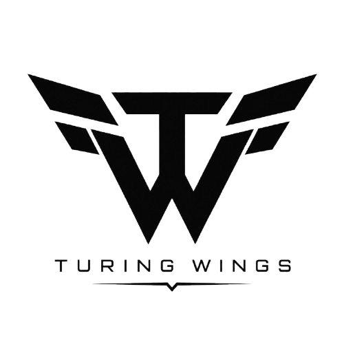

<div align="center">

  

  # ⚡ TURING WINGS — ENGINEERING REIMAGINED

  **Next-Generation Multi-Agent AI Development Engine & Flagship Cohort Platform**

  [](https://reactjs.org/)
  [](https://vitejs.dev/)
  [](https://tailwindcss.com/)
  [](https://greensock.com/gsap/)
  [](https://www.framer.com/motion/)
  [](LICENSE)

  [🌐 Live Platform](https://turingwings.org) • [🚀 Flagship Cohorts](#-flagship-cohorts) • [⚡ Buildathons](#-buildathons--hackathons) • [🛠️ Architecture](#-system-architecture)

---

</div>

<br />

## 🌟 Overview

**Turing Wings** is an AI-native engineering accelerator and multi-agent development ecosystem. Built with a unified `#FAF8F5` cream-grey design system, **Cascadia Code** monospace typography, and `#22C55E` green accent tokens, Turing Wings equips engineering teams with autonomous AI agent workflows, real-time world models, and production cloud infrastructure.

```
┌─────────────────────────────────────────────────────────────────────────────┐
│                            TURING WINGS PLATFORM                            │
├───────────────────────────────┬─────────────────────────────────────────────┤
│ 🚀 FLAGSHIP LEARNING COHORTS  │ 8-10 Week Immersive AI Engineering Programs │
├───────────────────────────────┼─────────────────────────────────────────────┤
│ ⚡ GLOBAL BUILDATHONS         │ 48-Hour High-Speed Product Innovation Sprints│
├───────────────────────────────┼─────────────────────────────────────────────┤
│ 🎨 6-THEME EVENT ENGINE      │ Cyberpunk • Space • Corporate • 3D • Minimal│
├───────────────────────────────┼─────────────────────────────────────────────┤
│ 🤖 MULTI-AGENT STACK          │ Team + Turing Wings Agents + World Model    │
└───────────────────────────────┴─────────────────────────────────────────────┘
```

<br />

---

## ✨ Key Features & Technical Capabilities

### 1. 🤖 Dynamic BuildWithAI Multi-Agent Stack
* **GSAP ScrollTrigger Pinned Animation**: Interactive 2-column sticky scroll showcase matching live engineering workflows.
* **Accumulating Wireframe Stack**: Step-by-step visual progression rendering `Your Team` ➔ `Turing Wings Agents` ➔ `World Model` ➔ `Production Cloud`.

### 2. 🎨 Multi-Template Event Webpage Engine
* **6 Dynamic Canvas Themes**: Supports standalone event pages (`/events/:slug`) with custom theme engines:
  - ⚡ **Cyberpunk Neon**: Perspective neon grid canvas with digital laser rain.
  - 🌌 **Space Odyssey**: Twinkling starfield with orbiting constellation trajectories.
  - 🏢 **Corporate Pro**: Executive blueprint grid with moving blue light beams.
  - 🧊 **Premium 3D Spatial**: Interactive 3D wireframe emerald floating cubes.
  - 🍃 **Minimal Light**: Clean `#FAFAFA` cream canvas with green dot matrix motion.
  - 🔮 **AI Future**: Neural network nodes with golden glass particle lines.

### 3. 🚀 Flagship Cohorts & Buildathon Directories
* **Live Cohort Showcase**: Integrated filtering for flagship programs (*AI-Native Software Development*, *Autonomous Agent Engineering*, *AI Cybersecurity*).
* **Live Event Portals**: Instant registration, track prize listings, mentor rosters, and custom rule specifications.

### 4. 📜 Complete Legal & Route System
* **Global Scroll-to-Top Navigation**: SPA route updates automatically reset scroll to top via global `<ScrollToTop />`.
* **Launch-Ready Legal Coverage**: Built-in Privacy Policy (`/privacy`) and Terms of Service (`/terms`) pages.

<br />

---

## 🛠️ Tech Stack & Dependencies

| Category | Technology | Purpose |
| :--- | :--- | :--- |
| **Framework** | React 18.3 | Core UI Component Architecture |
| **Build Tool** | Vite 8.0 | High-speed HMR & Production Bundler |
| **Styling** | Vanilla Tailwind CSS 3.4 | Unified Design Tokens & Grid Layouts |
| **Typography** | Cascadia Code | Monospace High-Contrast Font |
| **Scroll Animation** | GSAP 3.12 + ScrollTrigger | Sticky Section Pinned Animations |
| **UI Motion** | Framer Motion 11 | Smooth Page & Card Motion Transitions |
| **Icons** | Lucide React | Clean Vector Icons |
| **Canvas** | HTML5 Canvas API | 6 Dynamic Animated Theme Backgrounds |

<br />

---

## 📂 Project Structure

```
VybeAI/
├── public/
│   ├── Logos/
│   │   ├── BlackFillNoBg.png       # Primary High-Res Turing Wings Logo
│   │   └── IconNoBg.png            # Monogram Icon Token
│   └── admin-logo.png              # Transparent Admin Wing Logo
├── src/
│   ├── components/
│   │   ├── Navbar.jsx              # Responsive Header Navigation
│   │   ├── Hero.jsx                # Landing Hero with Dynamic Counter
│   │   ├── BuildWithAI.jsx         # Pinned GSAP Multi-Agent Wireframe Stack
│   │   ├── Evolution.jsx           # Engineering Shift Showcase
│   │   ├── Stack.jsx               # Technology Stack Capabilities
│   │   ├── Cohorts.jsx             # Flagship Learning Cohorts Showcase
│   │   ├── WhyTuringWings.jsx      # Core Differentiators & Values
│   │   ├── Footer.jsx              # Unified Footer with Legal Links
│   │   └── ScrollToTop.jsx         # Global SPA Route Reset Component
│   ├── pages/
│   │   ├── HomePage.jsx            # Main Landing Page Composition
│   │   ├── BuildathonsPage.jsx     # Live Buildathons Directory
│   │   ├── ContactPage.jsx         # Contact & Support Hub
│   │   ├── PrivacyPolicyPage.jsx   # Launch-Ready Privacy Policy Page
│   │   ├── TermsOfServicePage.jsx  # Launch-Ready Terms of Service Page
│   │   └── EventPortalPage.jsx     # Multi-Template Standalone Event Page
│   └── modules/
│       └── hackathon/
│           └── templates/
│               ├── TemplateRegistry.jsx   # Multi-Template Theme Registry
│               └── ai-future/
│                   └── backgrounds/       # 6 HTML5 Canvas Animated Backgrounds
│                       ├── CyberpunkBackground.jsx
│                       ├── SpaceBackground.jsx
│                       ├── CorporateBackground.jsx
│                       ├── Spatial3dBackground.jsx
│                       ├── MinimalBackground.jsx
│                       ├── AiFutureBackground.jsx
│                       └── ThemeBackgroundSwitcher.jsx
├── index.html                      # HTML Entry Point (Favicon & Cascadia Font)
├── package.json                    # Project Dependencies & Scripts
└── tailwind.config.js              # Tailwind Design Tokens Configuration
```

<br />

---

## ⚡ Quickstart & Local Setup

### 1. Prerequisites
Ensure you have **Node.js 18.0+** and **npm** installed on your system.

### 2. Clone Repository
```bash
git clone https://github.com/manikantac4/VybeAI.git
cd VybeAI
```

### 3. Install Dependencies
```bash
npm install
```

### 4. Start Local Development Server
```bash
npm run dev
```
Open [http://localhost:5173](http://localhost:5173) in your browser.

### 5. Build for Production
```bash
npm run build
```

<br />

---

## 🎨 Design Tokens & Aesthetic Standards

```css
/* Core Color Tokens */
--bg-primary: #FAF8F5;       /* Cream Grey Canvas */
--bg-dark: #090909;          /* High-Contrast Card Background */
--accent-green: #22C55E;     /* Primary Accent Highlight */
--text-main: #111111;        /* High-Contrast Body Text */

/* Typography */
font-family: 'Cascadia Code', monospace;
```

---

<div align="center">

  **Crafted with Precision by Turing Wings Engineering Team**

  © 2026 Turing Wings. All rights reserved.

</div>
